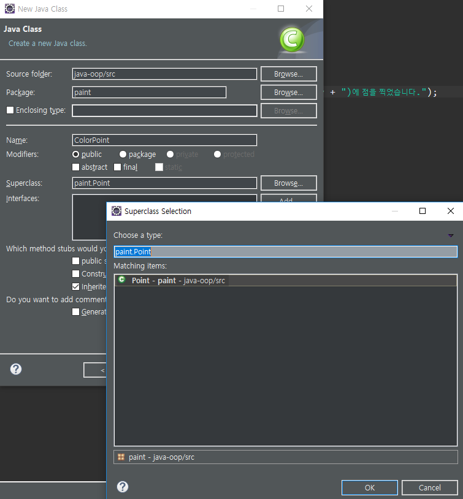
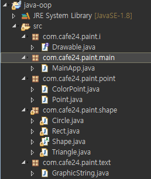
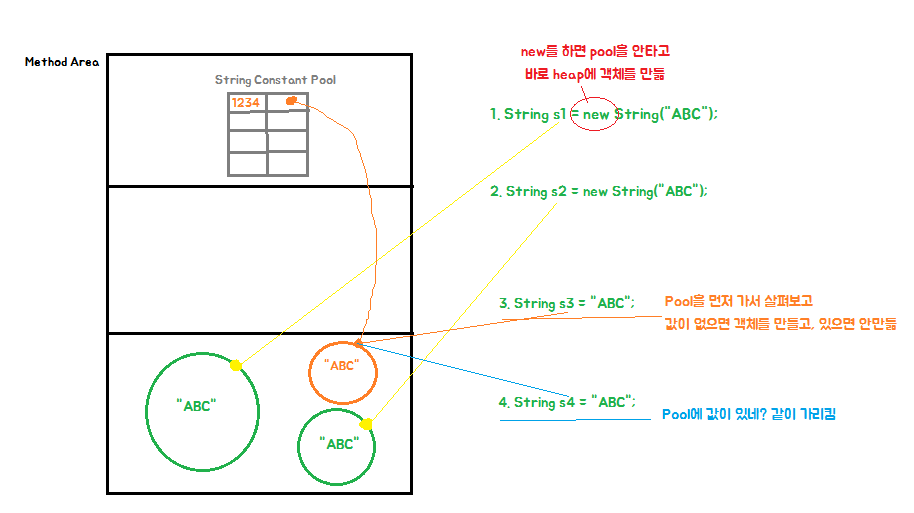

[TOC]


---


------

< 자바의 맥락 >

기본프로그래밍

객체지향개념

객체지향 프로그래밍

Java API

Thread / network programming

servlet / jsp

spring mvc


------

기본프로그래밍

변수 = 저장공간의 심볼임(메모리주소)

uml 자바 책, cbd 책 추천


------

# Swap Test

**java-oop/src/swap/SwapTest.java**

int를 보낼경우, stack영역에 각각의 다른 변수가 생김!

Value같은 경우는 heap애 객체를 만들고 변수를 묶어서 주소값을 보내기 때문에

같은 주소를 가리키며, 그 주소의 객체안의 값을 변경시키기에 가능함!

------


# 자바 OOP 연습

## 간단한 그림판

### 1. 간단한 좌표에 점 찍기!

**paint/Point.java**

```java
package paint;
public class Point {
	private int x;
	private int y;
	
    public Point() {
		super();
	} // 기본 생성자를 만들어야함!
    
	public Point(int x, int y) {
		this.x = x;
		this.y = y;		
	}
	public void show() {
		System.out.println("점 ( " + this.x + ", " + this.y + ")에 점을 찍었습니다.");
	}
	
}
```


**paint/MainApp.java**

```java
package paint;

public class MainApp {

	public static void main(String[] args) {
		Point p1 = new Point(10, 20);
		drawPoint(p1);
	}
	
	public static void drawPoint(Point point) {
		point.show();
	}
}
```

> ```출력
> 점 ( 10, 20)에 점을 찍었습니다.
> ```


### 2. 색이 있는 점

> Point 점을 상속받은 ColorPoint를 만든다!
>
> 


**Point.java**  >> getter, setter를 만드는게 좋지만 연습이니까 그냥 protected!

```java
	protected int x;
	protected int y;
```

**paint**/**ColorPoint.java**

```java
public class ColorPoint extends Point {
	private String color;
    
	public ColorPoint(int x, int y, String color) {
		super(x, y);  // 부모에 기본 생성자가 없을경우, 거기 있는 생성자에 맞춰 넣으면 됨
		this.color = color;
	}
    
    @Override
	public void show() {
		System.out.println("좌표 ( " + this.x + ", " + this.y + ")에 "+ this.color +"점을 찍었습니다.");
	}
}
```

**Point.java**  >> getter, setter를 만드는게 좋지만 연습이니까 그냥 protected!

```java
	protected int x;
	protected int y;
```


**MaintApp.java**

```java
package paint;
public class MainApp {

	public static void main(String[] args) {
		Point p1 = new Point(10, 20);
		// 점찍기
		drawPoint(p1);
		
		ColorPoint p2 = new ColorPoint(50,  100,  "red");
		drawPoint(p2);
	}
	
	public static void drawPoint(Point point) {
		point.show();
	}
	
	public static void drawPoint(ColorPoint colorPoint) {
		colorPoint.show();
	}
}
```

> ```출력
> 좌표 ( 10, 20)에 점을 찍었습니다.
> 좌표 ( 50, 100)에 red점을 찍었습니다.
> ```

**근데 여기서 문제!!**

`ColorPoint p2 = new ColorPoint(50,  100,  "red");` 에서 부모로 받으면 좋잖아??

> `Point p2 = new ColorPoint(50,  100,  "red");`

그럼 Main에서 drawPoint()메소드 오버로딩 할 필요 없음!

**MainApp.java**

```java
package paint;
public class MainApp {
    
	public static void main(String[] args) {
		Point p1 = new Point(10, 20);
		// 점찍기
		drawPoint(p1);
		
		Point p2 = new ColorPoint(50,  100,  "red");
		drawPoint(p2);
	}
	
	public static void drawPoint(Point point) {
		point.show();
	}

}
```

------


### 3. 점 지우기

**Point.java**

```java
public void show(boolean visible) {
    if(visible) {			
        System.out.println("좌표 (" + this.x + ", " + this.y + ")에 점을 찍었습니다.");
    }else {
        System.out.println("좌표 (" + this.x + ", " + this.y + ")에 점을 지웠습니다.");
    }
}
```

**MainApp.java**

```java
		p1.show(false);
		p2.show(false);
```


`p2.show(true);` 를 부르면 색깔점이 안찍히고 그냥 점만 찍힘

--> **ColorPoint.java** 에서도 오버라이드 해야함!

**Point.java** 에서 오버라이드를 이미 한 show() 메소드를 재사용하면 됨!!

```java
public void show(boolean visible) {
    if(visible) {			
//System.out.println("좌표 (" + this.x + ", " + this.y + ")에 점을 찍었습니다.");
        show();
        return;
    }
    System.out.println("좌표 (" + this.x + ", " + this.y + ")에 점을 지웠습니다.");
}
```

------


### 4. 도형 그리기

#### - 삼각형

이제부턴 좌표(데이터) 신경 안쓰고 확인만 하겠음

**Triangle.java**

```java
package paint;
public class Triangle {
	private int x1;
	private int x2;
	private int x3;
	private int y1;
	private int y2;
	private int y3;
	
	private String fillColor;
	private String lineColor;
	
	public void draw() {
		System.out.println("삼각형을 그렸습니다.");
	}
}
```

**MainApp.java**

```java
		Triangle triangle = new Triangle();
		drawTriangle(triangle);
```

```java
	public static void drawTriangle(Triangle triangle) {
		triangle.draw();
	}
```


**근데! 삼각형만 만들거야?**

**사각형, 오각형 .. 등 도형은 계속 생기잖아**

**도형을 추상클래스를 올리면 어떨까?**


#### - 사각형

**Shape.java**

```java
package paint;

public abstract class Shape {
	
	private String fillColor;
	private String lineColor;
	
	public abstract void draw();
	
}
```

> 현재 어떤 도형을 그릴지 아직 몰라, 구현은 자식에게 맡긴다!

**Triangle.java**

```java
package paint;
public class Triangle extends Shape {
	private int x1;
	private int x2;
	private int x3;
	private int y1;
	private int y2;
	private int y3;
	
	@Override
	public void draw() {
		System.out.println("삼각형을 그렸습니다.");
	}
}
```

**Rect.java**

```java
package paint;

public class Rect extends Shape {
	private int x1;
	private int x2;
	private int x3;
	private int x4;
	
	private int y1;
	private int y2;
	private int y3;
	private int y4;
	
	@Override
	public void draw() {
		// TODO Auto-generated method stub
		System.out.println("사각형을 그렸습니다.");
	}
}
```

**MainApp.java**

```java
package paint;

public class MainApp {

	public static void main(String[] args) {
		// 점 찍기
		Point p1 = new Point(10, 20);
		drawPoint(p1);
		
		// 색깔 점 찍기
		Point p2 = new ColorPoint(50,  100,  "red");
//		drawPoint(p2);
		p2.show(true);
		
		// 점 지우기
		p1.show(false);
		p2.show(false);
		
		Shape triangle = new Triangle();
		draw(triangle);
		
		Shape rect = new Rect();
		draw(rect);
		
	}
	
	public static void drawPoint(Point point) {
		point.show();
	}
	
	public static void draw(Shape shape) {
		shape.draw();
	}
}
```


#### - 원

**Circle.java**

```java
package paint;
public class Circle extends Shape {
	private int x;
	private int y;
	private int radius;
	
	@Override
	public void draw() {
		System.out.println("원을 그렸습니다.");
	}
}
```

**MainApp.java**

```java
		Shape circle = new Circle();
		draw(circle);
```


**문제!!**

**Point까지 포함하는 클래스를 만들고 싶으면**

**interface를 만들어야함**

 **-> Shape를 Point가 상속받으면 fillColor 등 필요없는것도 상속받아야하잖아!**


------

### 5. interface

**Drawable.java**

```java
package paint;

public interface Drawable{
	void draw();
}

```

**Shape.java**

```java
package paint;

public abstract class Shape implements Drawable{
	
	private String fillColor;
	private String lineColor;
    
    public abstract float calcArea();
	// 자식에서 오버라이드 하면 됨
}
```

**자식 클래스들**

```java
	@Override
	public float calcArea() {
		return 0.f;
	}
```

**Point.java**

```java
package paint;

public class Point implements Drawable {
    ...
    ...
        
	@Override
	public void draw() {
		show();
	}

}

```


**MainApp.java** 수정

```java
package paint;

public class MainApp {

	
	public static void main(String[] args) {
		// 점 찍기
		Point p1 = new Point(10, 20);
		draw(p1);
		
		// 색깔 점 찍기
		Point p2 = new ColorPoint(50,  100,  "red");
		draw(p2);
		
		// 점 지우기
		p1.show(false);
		p2.show(false);
		
		Shape triangle = new Triangle();
		draw(triangle);
		
		Shape rect = new Rect();
		draw(rect);
		
		Shape circle = new Circle();
		draw(circle);
		
	}
	
	public static void draw(Drawable drawable) {
		drawable.draw();
	}

}
```

> **메소드 하나로 모두 다 실행할 수 있게됨!!!!!!** 

------

**얼마나 확장성이 높아지고 간편해 졌는지 기능을 추가해볼까??**

------

### 6. 텍스트 그리기

**GraphicString.java**

```java
package paint;

public class GraphicString implements Drawable {
	
	private String text;

	public GraphicString(String text) {
		this.text = text;
	}

	@Override
	public void draw() {
		System.out.println(text + "를 그렸습니다.");

	}
}
```

**MainApp.java**

```java
draw(new GraphicString("hello~~"));
```

**아래 코드 추가, 수정없이 딱 한줄로 해결 가능!**


------

# package 나누기




---


# Object

## 1. ObjectTest01.java

### - getClass()

**reflection :  객체가 어떤 클래스로 생성됐는지**

```java
package object.text;
public class ObjectTest01 {
    public static void main(String[] args) {
        Point p = new Point(10, 20);

        System.out.println(p.getClass()); 
    }
}
```

> class object.text.Point


### - hashCode()

 **address 기반의 hashing값**

**: hashing?** = 알고리즘상 빨리 찾기 위해서 

> 매핑으로 변수에 저장되는 값은 reference값이 맞지만,
>
> 출력으로 보여주는 것은 reference값이 아닐거라고 추측한다! 
>
>  (물론 주소도 아닐듯) 

```java
System.out.println(p.hashCode());
```

> 366712642


### - toString()

**getClass() + "@" + hashCode()**

```java
		System.out.println(p);
		System.out.println(p.toString());
```

> println에 객체를 넣으면 자동으로 toString()을 불러옴

> object.text.Point@15db9742

---


---

## 2. ObjectTest02.java

### - ==

**두 객체의 동일성 비교 (같은 객체냐!)**

```java
package object.text;

public class ObjectTest02 {

	public static void main(String[] args) {
		Point p1 = new Point(10, 20);
		Point p2 = new Point(10, 20);
		Point p3 = p2;
		
		System.out.println(p1==p2);
		System.out.println(p2==p3);
	}
}
```

> ```
> false
> true
> ```


### - equals()

두 객체의 동질성을 비교한다. (내용 비교)

```java
	System.out.println(p1.equals(p2));
	System.out.println(p2.equals(p3));
```
> ```
> false
> true
> ```

​										뭐야! 다 같은데 왜 fasle나오는데?


​							equals의 원래 구현은 동일성(==) 과 **같게** 구현되어있어

​							그래서 오버라이드를 해줘야해 내용비교를 하고싶으면

**Point.java** -> alt+s 로 오버라이드 추가 

```java
...	
	@Override
	public int hashCode() {
		final int prime = 31;
		int result = 1;
		result = prime * result + x;
		result = prime * result + y;
		return result;
	}

	@Override
	public boolean equals(Object obj) {
		if (this == obj)
			return true;
		if (obj == null)
			return false;
		if (getClass() != obj.getClass())
			return false;
		Point other = (Point) obj;
		if (x != other.x)
			return false;
		if (y != other.y)
			return false;
		return true;
	}

	@Override
	public String toString() {
		return "Point [x=" + x + ", y=" + y + "]";
	} // 내용기반으로 오버라이딩
```

> equals는 hashcode와 같이 오버라이드 해줘야 성능이 좋아짐
>
> -> 어떤 객체의 동질성을 비교할때는 항상 hashcode를 뽑아서 비교를함


### - String / hashCode()

```java
		// String
		String s1 = new String("ABC");
		String s2 = new String("ABC");
		System.out.println(s1 == s2);
		System.out.println(s1.equals(s2));
		System.out.println(s1.hashCode() + " : " + s2.hashCode());
        System.out.println(System.identityHashCode(s1) + " : " + System.identityHashCode(s2) );
```

> ```
> false
> true  
> 64578 : 64578
> 366712642 : 1829164700
> ```
>
> 다른 객체니까 동일성에선 false
>
> - identityHashCode : override되기 전 해시코드!

#### HashCode / identityHashCode

- HashCode는 내용기반
- identityHashCode 는 주소기반!


**근데** 

`String s = "ABC";` 이건 어떻게 가능해! 객체에 new를 안하고!!!!

```java
    String s3 = "ABC";
    String s4 = "ABC";

    System.out.println(s3 == s4);
    System.out.println(s3.equals(s4));
    System.out.println(s3.hashCode() + " : " + s4.hashCode());
    System.out.println(System.identityHashCode(s3) + " : " + System.identityHashCode(s4) );	
```

> ```
> true
> true
> 64578 : 64578
> 2018699554 : 2018699554
> ```
>
> 뭐야! 내부적으로 알아서 new 하고 만든다면,, 왜 이 값이 다 같은거야?
>
> --> String Constant Pool을 안거치기때문!!!
>
> 


---

## 3. ObjectTest03.java

### - HashSet

```java
package object.text;

import java.util.HashSet;
import java.util.Set;

public class ObjectTest03 {

	public static void main(String[] args) {
		Set<Point> set = new HashSet<Point>();
		
		Point p1 = new Point(10,20);
		set.add(p1);
		
		Point p2 = new Point(100,200);
		set.add(p2);
		
		Point p3 = p1;
		set.add(p3);
		
		for(Point p : set) {
			System.out.println(p);
		}
	}
}
```

> ```
> Point [x=100, y=200]
> Point [x=10, y=20]
> ```

만약 Point의 HashCode() 메소드를 지우고 실행하면?

> ```
> Point [x=100, y=200]
> Point [x=10, y=20]
> Point [x=10, y=20]
> 
> ```
>
> 3개가 들어감!

---


